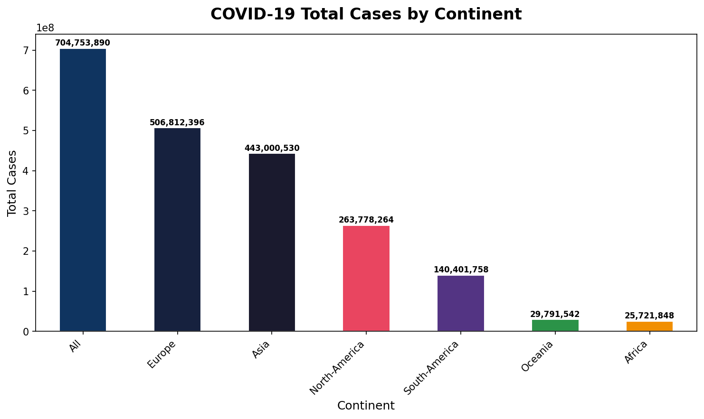

 # COVID-19 Data Analysis Pipeline

A modular, production-ready data analysis pipeline built with Python to analyze and visualize global COVID-19 statistics by continent.

##  Output Visualization

##  Project Overview

This project implements an Object-Oriented Programming (OOP) based data pipeline that loads, cleans, analyzes, and visualizes COVID-19 data across 236 countries and territories. It demonstrates real-world software engineering practices such as modular design, error handling, and clean code structure.

##  Tech Stack

1. Python 3.x : Core programming language 
2. Pandas     : Data loading, cleaning & analysis 
3. Matplotlib : Data visualization 
4. CSV        : Data source format 

##  Project Structure

covid-pipeline/
│
├── covid_pipeline.py       # Main pipeline class
├── covid19_stat.csv        # Dataset (COVID-19 statistics - 236 records)
├── covid_cases.png         # Output bar chart visualization
└── README.md               # Project documentation

##  Features

1. **Load Data** — Reads COVID-19 dataset from CSV using Pandas
2. **Clean Data** — Removes irrelevant columns (`time_hms`) and handles missing values
3. **Analyze Data** — Groups and aggregates total cases by continent, sorted by volume
4. **Visualize Data** — Generates a labeled bar chart saved as PNG
5. **Modular OOP Design** — Each pipeline step is a clean, reusable method
6. **Error Handling** — Graceful handling of missing files

##  How to Run

### 1. Clone the repository
bash
git clone https://github.com/Bhavya-Annabattula/covid-pipeline.git
cd covid-pipeline

### 2. Install dependencies
bash
pip install pandas matplotlib

### 3. Run the pipeline
bash
python covid_pipeline.py

##  Results

Total COVID-19 cases aggregated by continent from the dataset:

 Continent     | Total Cases 

 All (Global)  | 704,753,890 
 Europ         | 506,812,396 
 Asia          | 443,000,530 
 North America | 263,778,264 
 South America | 140,401,758 
 Oceania       | 29,791,542 
 Africa        | 25,721,848 

> Dataset contains records from **236 countries/territories** as of January 2026.

##  Key Concepts Demonstrated

1. Object-Oriented Programming (OOP) with Python classes
2. Data preprocessing and cleaning using Pandas
3.  Data aggregation and groupby operations
4.  Bar chart visualization with value labels using Matplotlib
5.  Modular pipeline architecture with `run()` method
6.  Error handling with try/except blocks
7.  Clean code and documentation practices

##  Dataset Columns

 Column          | Description 

 continent       | Geographic region 
 country         | Country or territory name 
 cases.total     | Cumulative confirmed cases 
 cases.active    | Currently active cases 
 cases.recovered | Total recovered 
 cases.critical  | Critical cases 
 deaths.total    | Total deaths 
 population(k)   | Population in thousands 
 test.total (k)  | Total tests in thousands 
 date            | Record date 

##  Author

**Annabattula Sai Bhavya Sri**  
B.Tech CSE | Andhra University College of Engineering (A), Visakhapatnam  
GMAIL: bhavya.annabattula@gmail.com  
[LinkedIn](https://www.linkedin.com/in/bhavya-annabattula-692112320)   
[GitHub](https://github.com/Bhavya-Annabattula)  
[Credly Certifications](https://www.credly.com/users/bhavya-annabattula)

##  License

This project is open source and available under the [MIT License](LICENSE). is open source and available for everyone.
